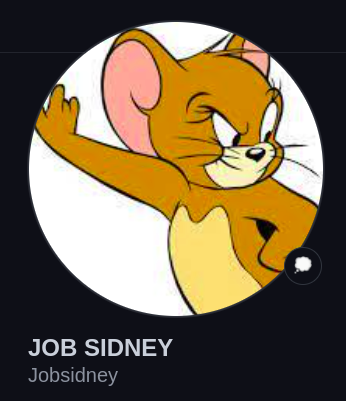

# PERSONAL PORTFOLIO
***
## DESCRIPTION
This personal portfolio showcases my personal proffetional details including skills and how to contact me at any time.
 example:

<br  />
## Site:
Here is a working demonstration of this Web page: https://jobsidney.github.io/PortfolioWeb/
<br  />

When you visit the site, this is the view:
  

<br  />
You can see some of my well documentend projects and area of specialization.
Example:

<br  />

## [Features](https://jobsidney.github.io/PortfolioWeb/)

- Well Designed Interface(UI).
- intensive use of Vanilla css for design
- Javascript
- HTML5
- Switch to multiple pages via links and buttons
- Responsive to variety of devices like mobile,tablet and PC


## [InstallationInstructions](https://jobsidney.github.io/Quiz-Board/) 
Click on the provided link that will direct you to the website
#### requirements:
- chrome browser/any other browser
- any type of computer(phone of laptop)
- Internet connection

## Target to future improvement
- Incoperate JQuery,Nodejs
- Add animated effects
- Add communication bot to enable set meeting with cliants automatically.

### Program Sample
#### Html code
```Html
    <section id="header">
        <section id="Navigation">
            <nav>
                <ul>
                    <li><a href="#My-Services">Services</a></li>
                    <li><a href="#works">Works</a></li>
                    <li><a href="#blogs">Blogs</a></li>
                </ul>
            </nav>
        </section>
```

#### Css
    Example of Css
```Css
.btnStory{
    border: 1px solid yellow;
    height: 40px;
    width: 150px;
    border-radius: 5px;
    color: yellow;
    font-weight: 800;
    font-size: large;
    margin-top: 5vh;
    text-align: center;
    padding-top: 2%;
    cursor: pointer;
}
#mobiApp,#exploWeb{
    cursor: pointer;
}
```
#### Javascript
    Example of working javascript code
```Javascript
function navigate(identification,event,url) {
    identification.addEventListener(`${event}`,function(){
        window.location.href=`${url}`;
    })
    
}
```
## ProgramDesign
This website was designed by the author using Figma Design Software.
you can View the design from this link: https://www.figma.com/file/6TLYivnqiQAeMuEk0kEULC/Untitled?node-id=2%3A5
- Set the zoom level to 50%
- Then click on prototype to view it in Desktop mode.
- NB: NO contributions on the Figma Design file.

## PROJECT AUTHOR
- Jobsidney
- [](https://github.com/Jobsidney/)
***

## license information.
### The MIT License
[](https://opensource.org/licenses/MIT)  
`[](https://opensource.org/licenses/MIT)`
